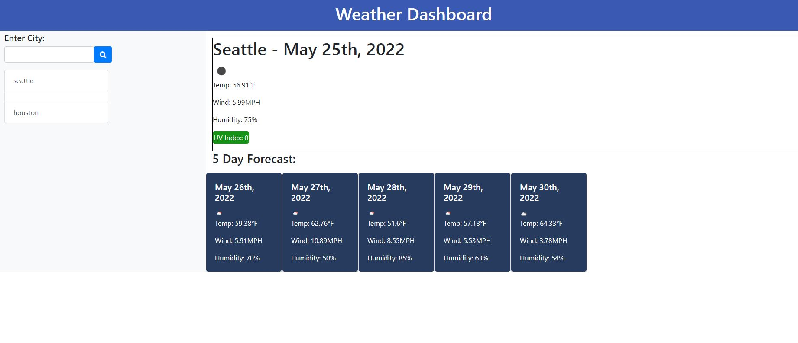

# Server-Side-APIs-Weather-Dashboard


---

# Description

This weather application utilizes the external api from OpenWeather to retrieve weather data for cities searched by the user. When a city is searched, the user is presented with current and future conditions for that city and that city is added to the search history dynamically upon page refresh. When one of these cities in the search history is clicked, the user is presented again with current and future weather conditions for that city. In addition to the current weather conditions, the user is presented with the city name, date, an icon representation of weather conditions, humidity, wind speed, and the UV index.

Moreover, the UV index is displayed with a color that indicates whether the UV conditions are favorable, moderate, or severe.

&nbsp;

---
# Table of Contents

  - [Description](#description)
  - [Table of Contents](#table-of-contents)
  - [Usage](#usage)
  - [Technologies Used](#technologies-used)
  - [Acceptance-Criteria](#acceptance-criteria)
  - [Screenshots](#screenshots)
  - [Contributing](#contributing)
  - [Contact](#contact)
  - [License](#license)

&nbsp;

---
# Installation

Instructions: 
1. Fork the application repository from GitHub and clone this project to your machine.
2. Open the project with your preferred text-editor, such as VS code.
3. Prerequisite installations: Node.js, MySQL.
4. This project includes a `package.json` file that specifies dependencies for this project, which can be installed by running the command `"npm install"`.

&nbsp;

---
# Usage

```
AS A traveler
I WANT to see the weather outlook for multiple cities
SO THAT I can plan a trip accordingly
```

&nbsp;

---
# Technologies Used

- [HTML](https://html.com/)
- [CSS](https://developer.mozilla.org/en-US/docs/Web/CSS)
- [Javascript](https://www.javascript.com/)
- [JQuery](https://www.jquery.com)
- [Boostrap](https://www.getbootstrap.com)


&nbsp;

---
## Acceptance Criteria

```
GIVEN a weather dashboard with form inputs
WHEN I search for a city
THEN I am presented with current and future conditions for that city and that city is added to the search history
WHEN I view current weather conditions for that city
THEN I am presented with the city name, the date, an icon representation of weather conditions, the temperature, the humidity, the wind speed, and the UV index
WHEN I view the UV index
THEN I am presented with a color that indicates whether the conditions are favorable, moderate, or severe
WHEN I view future weather conditions for that city
THEN I am presented with a 5-day forecast that displays the date, an icon representation of weather conditions, the temperature, the wind speed, and the humidity
WHEN I click on a city in the search history
THEN I am again presented with current and future conditions for that city
```
&nbsp;

---
# Screenshots

## Main Page


---
# Contributing

If you would like to contribute or have any questions, please feel free to contact me via email or GitHub.
&nbsp;

---
# Contact

- Joe Choe | [Github](https://github.com/jchoe125) | [email](joechoe125@gmail.com)


&nbsp;

---
## License

[MIT License](./LICENSE) 

Copyright (c) 2022

Permission is hereby granted, free of charge, to any person obtaining a copy
of this software and associated documentation files (the "Software"), to deal
in the Software without restriction, including without limitation the rights
to use, copy, modify, merge, publish, distribute, sublicense, and/or sell
copies of the Software, and to permit persons to whom the Software is
furnished to do so, subject to the following conditions:

The above copyright notice and this permission notice shall be included in all
copies or substantial portions of the Software.

THE SOFTWARE IS PROVIDED "AS IS", WITHOUT WARRANTY OF ANY KIND, EXPRESS OR
IMPLIED, INCLUDING BUT NOT LIMITED TO THE WARRANTIES OF MERCHANTABILITY,
FITNESS FOR A PARTICULAR PURPOSE AND NONINFRINGEMENT. IN NO EVENT SHALL THE
AUTHORS OR COPYRIGHT HOLDERS BE LIABLE FOR ANY CLAIM, DAMAGES OR OTHER
LIABILITY, WHETHER IN AN ACTION OF CONTRACT, TORT OR OTHERWISE, ARISING FROM,
OUT OF OR IN CONNECTION WITH THE SOFTWARE OR THE USE OR OTHER DEALINGS IN THE
SOFTWARE.
